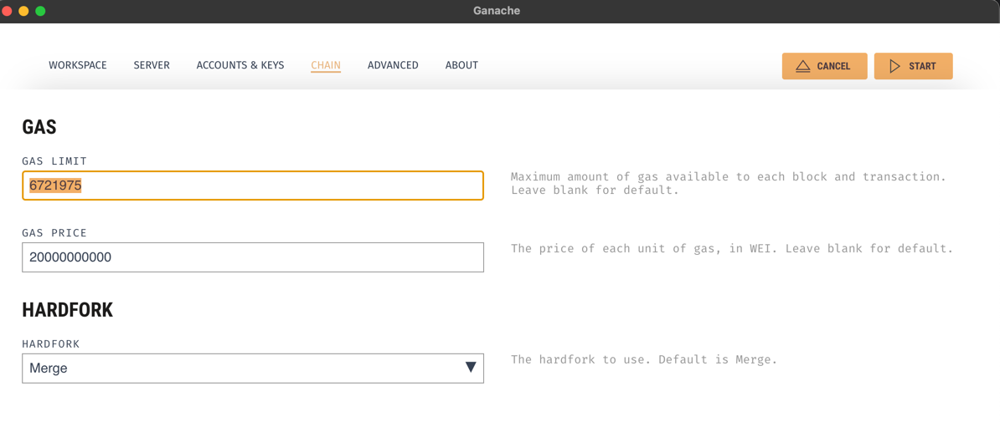

# Go service 
install go: https://go.dev/dl/

#### Dependencies
- `go get github.com/gofiber/fiber/v2`
- `go get -u gorm.io/gorm`
- `go get -u gorm.io/driver/sqlite`
- `go get github.com/gofiber/fiber/v2/middleware/cors`
- `go get github.com/mattn/go-isatty@v0.0.17` 
- `go get github.com/dgrijalva/jwt-go`
- `go get golang.org/x/crypto/bcrypt` 
- `go get github.com/joho/godotenv`

or 

`go mod tidy`

## React Webapp
See MusiChain_UI repo https://github.com/pobeaulieu/MusiChain_UI

# Database
The database is SQLite and is stored in the file system for ease of use (MusiChain.db). 

# API doc: Postman
import `MusiChain.postman_collection.json` in Postman and add `rootCA.crt` in the settings. 

# Smart Contracts

For now, I did not find a way to build the contracts with solc without errors.
Here is a workflow that worked for me. 

1. Compile base.sol on REMIX. Copy .abi in base.api and .bin in base.bin

2. Generate Go code to interact with the contract. It offers a wrapper to Deploy and other functionnality. 
`abigen --bin=pkg/services/build/Base.bin --abi=pkg/services/build/Base.abi --pkg=base --out=pkg/services/abigen/base/baseContract.go`
Note: since we need to specify a package and to make sure the generated code remains in isolation (same function names can happen), the generated code for the sale contract should be in pkg/services/abigen/sale.go 
I think this command should be used...
`abigen --bin=pkg/services/build/Sale.bin --abi=pkg/services/build/Sale.abi --pkg=sale --out=pkg/services/abigen/sale/saleContract.go`

References:
Command to build that did not work because of following error when deploying with the generated code from the build with solc:
2023/07/02 20:51:39 VM Exception while processing transaction: invalid opcode package services

`solc --bin --abi --overwrite  pkg/services/contracts/listing.sol -o pkg/services/build`

# Ganache

Note: only when we create a new workspace that we can set the gas limit. 
