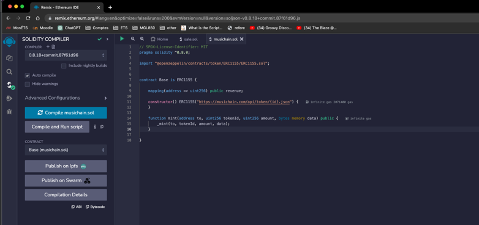
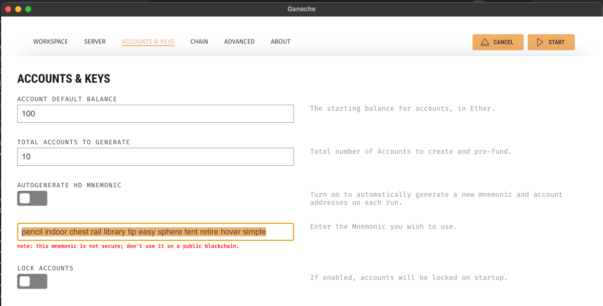
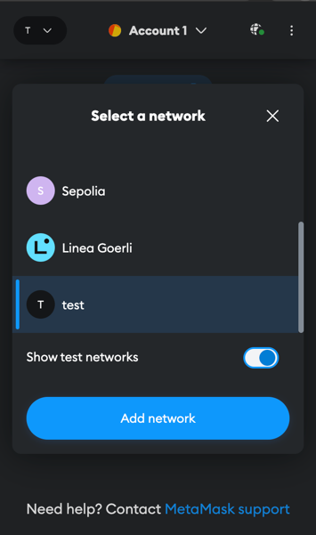
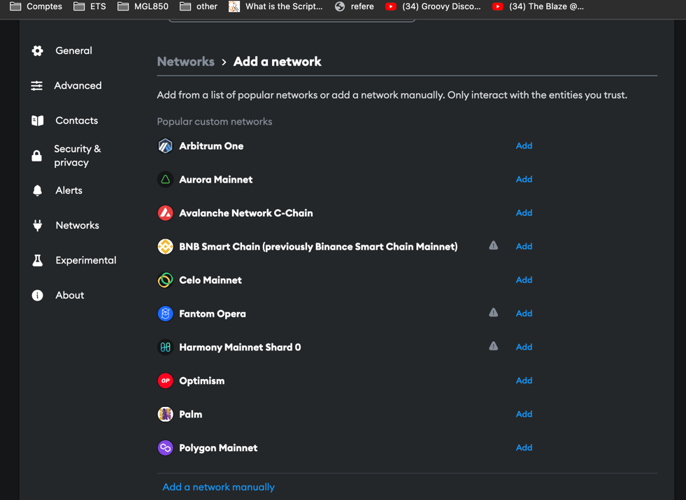
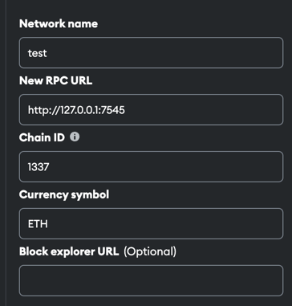
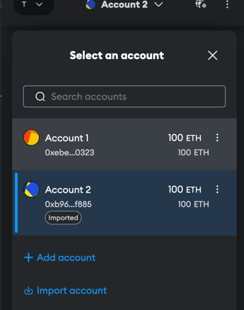
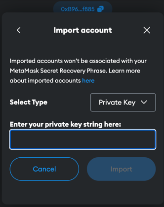
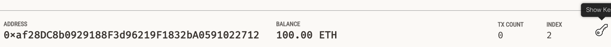

# Go service 
install go: https://go.dev/dl/

`go mod tidy`

## React Webapp
See MusiChain_UI repo https://github.com/pobeaulieu/MusiChain_UI

# Smart Contracts

For now, I did not find a way to build the contracts with solc without errors.
Here is a workflow that worked for me. 

1. Compile base.sol on REMIX. Copy .abi in base.api and .bin in base.bin

2. Generate Go code to interact with the contract. It offers a wrapper to Deploy and other functionnality. 
`abigen --bin=pkg/services/build/Base.bin --abi=pkg/services/build/Base.abi --pkg=base --out=pkg/services/abigen/base/baseContract.go`
Note: since we need to specify a package and to make sure the generated code remains in isolation (same function names can happen), the generated code for the sale contract should be in pkg/services/abigen/sale.go 
I think this command should be used...
`abigen --bin=pkg/services/build/Sale.bin --abi=pkg/services/build/Sale.abi --pkg=sale --out=pkg/services/abigen/sale/saleContract.go`

References:
Command to build that did not work because of following error when deploying with the generated code from the build with solc:
2023/07/02 20:51:39 VM Exception while processing transaction: invalid opcode package services

`solc --bin --abi --overwrite  pkg/services/contracts/listing.sol -o pkg/services/build`

# Connect Metamask with Ganache
1. Note your seed phrase of your Metamask Wallet somewhere. 
2. Create a new Ganache Workspace and provide your wallet seed phrase

3. Start Ganache Network
4. Add a new network in Metamask extension

5. Add network manually

6. This should connect the first account to your wallet. 
You can then import other accounts by coping the private key without 0x

